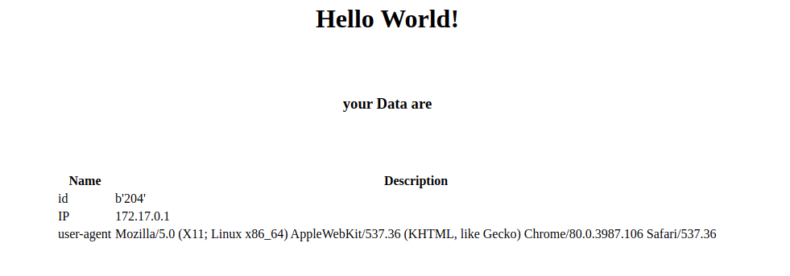

## Task 1:

  

 - Fork the task repo to your GitHub account, using whatever language you
   like to create a web-application that print hello world, and create a 
   DockerHub account to push images on it later on.

 - The application should have a non relational db, Redis and your core
   application, The app should count the users access that application,
   and save the count in Redis (have the ability to run two instances of
   your application or more), get the IP of the user and finally save the
   user IP with it’s count in the DB and finally print your name.

  

 - Make sure that all the configuration needed for the application
   (Redis and DB connection string for example) are passable at
   runtime(using environment variables or file).

  

 - Commit your changes to the REPO and push it under */APP*

  ### **Sample of output as the following**
 

  

  
**extra points :**

 - **EXTRA 1** , Create health check for your application on a specific
    route (ex: */health*) that returns **HTTP** status code **200** with **OK**
    message.
 - **EXTRA 2** , make key per user-agent in Redis to count how many
    users per user-agent accessed the application, print the *user-agent* in the
    application home, and push the user-agent also in the database.
 
 - **EXTRA 3** , create a route to visualize the content of the Redis on
    your application, ex : */redis-data* , */mongo-data*

##
## Task 2:

You will build your application from the GitHub repo and package it to be a runnable application, create a Docker image
to run that application and push it to your REPO .
create a script (bash/python or whatever you like) to perform the followings :

* Check if the requested IMAGE:TAG does not exist on your repository (DockerHub) in order to build the IMAGE / else exit
* Build a Dockerfile(multi-stage) with options1, (ex --docker_network=test , -t=TAG) to do the following:
	-   Build your application in the first stage and create an artifact that is runnable
	-   Create another stage to run that application
	-   Have the ability to run the image in debug mode:  
	    Application is not running, just a ready running container
    1Options:
        1.  Docker network=host
        2.  Build arguments:
            1.  IMAGE=helloworld
            2.  REPO=your_repo
            3.  PATH=/test/path
            4.  TAG=v1.0
*   Test that your application(container) is working / else exit
*   Push the image to your repo
*   Save the script as *builder.**EXTENSION*** and push it to the **REPO** under */scripts*

**extra points :**
 - **EXTRA 1**,  The script should handle exit status codes as follows:
 
    | **code**   |      **Debug message**      |  
    |----------|:-------------|
    | 2 |  Could not check if the image exists. | 
    | 3 |  Image $IMAGE exists on the repo. | 
    | 4 |  Building failed, $ERROR. | 
    | 5 |  Application failed in testing, $ERROR. | 
    | 6 |  Pusing failed, $ERROR. | 
    
 - **EXTRA 2** , make sure to keep the last 3 days logs only.
 - **EXTRA 3** , print the most-using (memory/cpu/load-average) processes in a log
       file under */var/log/system_statistics*
 - **EXTRA 3** , Make it with Ansible (playbooks and role)

##
## Task 3:

  

Create a Docker-Compose that starts up your application with the DB, Redis and your application.

Your Docker-Compose should have the ability to pass the configuration as options

  

 - **EXTRA 1** , make the docker-compose log the application to the STDOUT and the others to files
 - **EXTRA 2** , create SSL certificates for your application and add Nginx to proxy to the Application container, make sure to strip the SSL from the Nginx to the App

  
  
##
## Task 4:

  

 - Create an Ansible role that can do the following -- the installationshould be plain and don’t use your previously 
   created Dockerfiles :

	1.  install the required packages to run your application in a set of machines.    
	2.  Save the code Release on GitHub (create release if you did not already do) for your repo, the release should be 
	    saved on a file under */opt/my_app/release_version*.    
	3.  Create a cron jobs on the machines to do the following :
		1.  to pull the latest release on your **REPO**
		    (make handler to restart your application if needed)
		2.  Create log file for each change of releases with date stamp and save it under */var/log/my_app*

**extra points :**
 - **EXTRA 1** , make the log file only on the first node
 - **EXTRA 2** , make the machines using Vagrant script
 - **EXTRA 3** , a scheduled job to check the machines storage size and write it in another log file,
    (the job should only be set on the first node)

  
  
  
  
  
##
## Task 5:

  

Convert the docker-compose to a helm Chart, With the following specs:

1.  All the configuration passed through the values file
2.  A configmap as follows:	
    1. First file contain the Helm release and chart version
    2. Second contains your repo name.  
        1. All the data should be taken from the values file  
        2. the files should be mounted under */mnt/file_name.EXT*
4.  Ingress for your application
5.  Deployment/StatefulSet should have the readiness and liveness props configured correctly. First check the port is 
    opened, then check the health check (if you implement it)    
6.  Make three replicas of your application
7.  Deploy a headless service and provide(on the steps file) the connection string to get the health check or the home page
8.  Volume for your application under */var/log*
    1.  Values file with configurable sizes for Redis and the DB (you can use stable helm charts)
9.  Persistent data storage for DB
10.  Post-delete hook to clean up the volumes of your application (if exists )

**extra points :**
 - **EXTRA 1** , add the SSL certificates on your ingress controller
